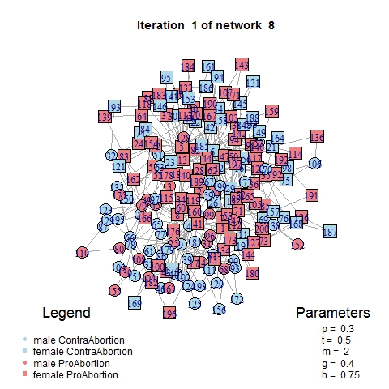

# Simulating Normative Conflict

This repository is complementing our chapter "The Role of Network Structure and Initial Group Norm Distribution in Norm Conflict" in [...add edited volume full title + editors]. In this chapter, we aim to study the impact of network structure and initial distribution of norms (group norm difference) on the process of arriving at a normative consensus between groups and the potential for intragroup and intergroup conflict that might emerge under different conditions. To this end, we developed an agent-based model that simulates a social network of agents from two different social groups where each agent holds one of two social norms. In an adapted version of the Granovetter Threshold Model, each agent updates its social norm by comparing the proportion of norms held by its immediate neighbors to an internal threshold drawn from a uniform distribution. Agents can thus be said to be "observing" the openly displayed behavior of their neighbors and adapt their own behavior accordingly if enough of their neighbors display a different norm. Importantly, we will test this mechanism for norm adaptation in different network structures, determined by relative group sizes and homophily/heterophily between agents from different groups. This will allow us to assess the impact of these structural network properties on the process of norm convergence and associated conflict potential. In addition, we run our model for different levels of group norm differences as initial conditions, so that we can also assess the influence of the degree to which norms are aligned with (or independent from) social group membership. Relevant outcome variables are the proportion of norms in the networks over time (or rather, iterations of our model) as well as the amount of ties in the network between agents with different norms within the groups and between the groups, as an operationalization for conflict potential. For a more detailed insight, you can check the full chapter, which is available at [add Open Access Link].

# Example Network:

# Overview of parameters:

**majority** This parameter takes an arbitrary text string as input to identify the majority group by attaching the string as a property to each node assigned to the majority, for example "male" or "female".

**{minority** This parameter takes an arbitrary text string as input to identify the minority group by attaching the string as a property to each node assigned to the minority, for example "male" or "female".

**majshape** This parameter specifies the shape of the nodes that are assigned to the majority group. Valid inputs are all shapes recognized by the vertex.shapes attribute in the plot() function of the igraph R package.

**minshape** This parameter specifies the shape of the nodes that are assigned to the minority group. Valid inputs are all shapes recognized by the vertex.shapes attribute in the plot() function of the igraph R package.

**majnorm** This parameter takes an arbitrary text string as input to identify the group of nodes that hold the attribute that is predominant in the majority. For example "pro-abortion" or "contra-abortion".

**minnorm** This parameter takes an arbitrary text string as input to identify the group of nodes that hold the attribute that is predominant in the minority. For example "pro-abortion" or "contra-abortion".

**majnormcolor** This parameter takes any valid color name in R as an input and visually identifies the group of nodes with the majnorm attribute.

**minnormcolor** This parameter takes any valid color name in R as an input and visually identifies the group of nodes with the minnorm attribute.

**r** Takes a single numeric value as input to specify how many networks of $each$ parameter configuration should be generated.

**nodes** Takes a single numeric value as input to specify how many nodes each network should contain. Every simulated network will contain the same amount of total nodes.

**iter** Takes a single numeric value as input to specify how many iterations of the norm updating process should be simulated.

**norm_end_maj** Takes a sequence of numeric values between 0 and 1 as input and specifies the proportion of nodes in the majority group that is attributed to the majnorm. The attribution co-occurs probabilistically with the sample() function in R, thus, exact values are not guaranteed.

**norm_end_min** Takes a sequence of numeric values between 0 and 1 as input and specifies the proportion of nodes in the minority group that is attributed to the majnorm. The attribution happens probabilistically with the sample() function in R, thus, exact values are not guaranteed.

**t** Takes either a single numeric value between 0 and 1 as input, or the text strings "uniform" or "normal". The parameter specifies the necessary percentage of neighboring nodes for a node to switch from their current attribute to the different one (e.g. if t = 0.6, at least 60\% of neighboring nodes have to display a different attribute for a node to change its attribute). For a single numeric value, all nodes are assigned the same value for t, for t = "uniform", values are drawn from a random uniform distribution between 0 and 1, and for t = "normal", values for t are drawn from a normal distribution with specified mean and standard deviation (see below) and truncated to values between 0 and 1.

**tmean** Only meaningful for t = "normal". Takes a single numeric value as input and specifies the mean of the normal distribution from which values for the parameter t are sampled.

**tsd** Only meaningful for t = "normal". Takes a single numeric value as input and specifies the standard deviation of the normal distribution from which values for the parameter t are sampled.

**m** Takes a single integer value as input and specifies the minimum number of edges that each node in the network forms.

**g** Takes a sequence of numeric values between 0 and 1  as input and specifies the proportion of nodes that are assigned to the minority.

**h** Takes a sequence of numeric values between 0 and 1 as input and specifies the degree to which nodes preferentially form edges with similar or dissimilar (majority or minority group) others.

**UpdateProcess** Takes either the text string "synchronous" or "asynchronous" as input and determines how the update process is executed. For synchronous updating, all nodes in a network update their attributes at the same time, for asynchronous updating, nodes update their attributes in a random order on each iteration, taking into account previous changes.

**cores** Specifies the numbers of cores that should be used in parallel for the simulation. On windows machines, only one core is supported.

**CreatePlots** Takes TRUE or FALSE as input and specifies whether jpeg plots are created for each iteration of every network (not recommended for larger networks or large parameter spaces).

**AnimatePlots** Takes TRUE or FALSE as input and specifies whether created jpeg plots should be combined into a GIF animation (see example - not recommended for larger networks or large parameter spaces).

