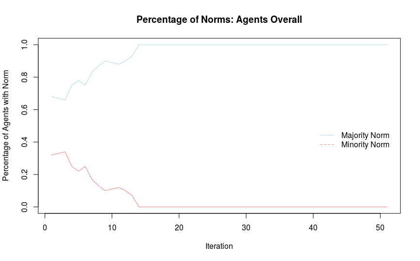
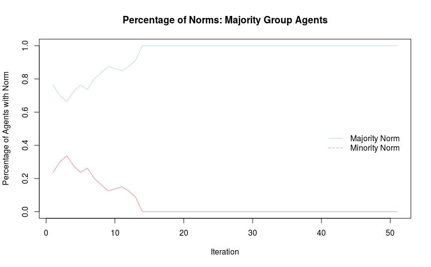
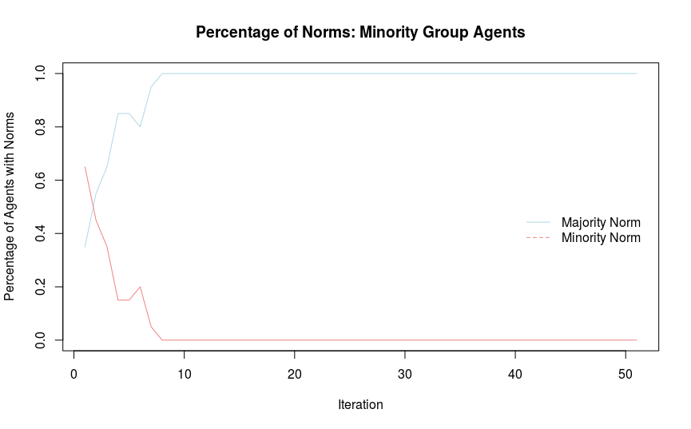
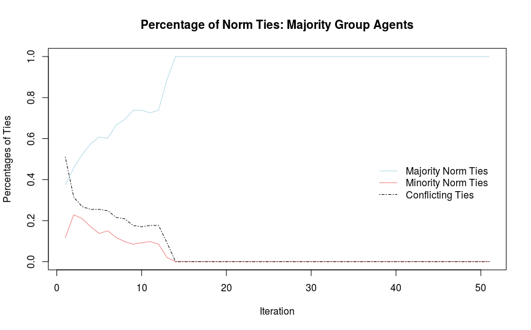
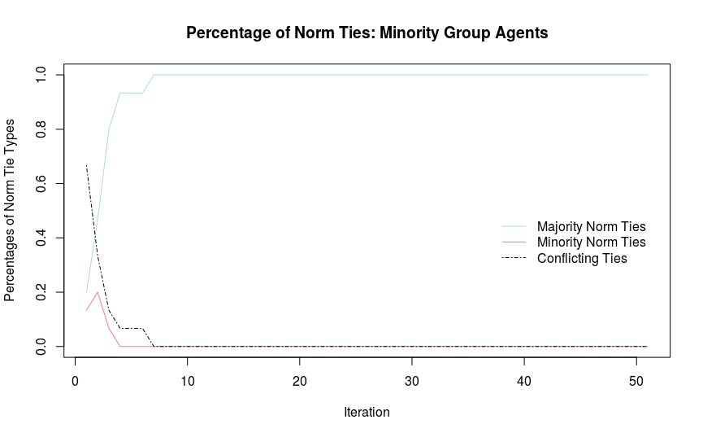
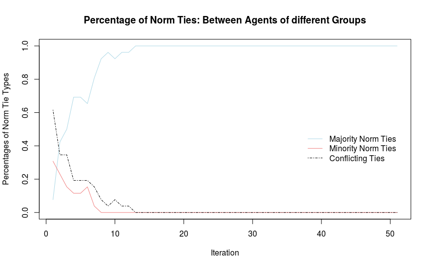

# Simulating Normative Conflict

This repository is complementing our chapter "The Role of Network Structure and Initial Group Norm Distributions in Norm Conflict" in the edited Volume _Computational Conflict Research_. In this chapter, we aim to study the impact of network structure and initial distribution of norms on the process of arriving at a normative consensus between groups and the potential for intragroup and intergroup conflict that might emerge under different conditions. To this end, we developed an agent-based model that simulates a social network of agents from two different social groups where each agent holds one of two social norms. In an adapted version of the Granovetter threshold model, each agent updates its social norm by comparing the proportion of norms held by its immediate neighbors to an internal threshold drawn from a uniform distribution. Agents can thus be said to be "observing" the openly displayed behavior of their neighbors and adapt their own behavior accordingly if enough of their neighbors display a different norm. Importantly, we will test this mechanism for norm adaptation in different network structures, determined by relative group sizes and homophily/heterophily between agents from different groups. This will allow us to assess the impact of these structural network properties on the process of norm convergence and associated conflict potential. In addition, we run our model for different levels of group norm distributions as initial conditions, so that we can also assess the influence of the degree to which norms are aligned with (or independent from) social group membership. Relevant outcome variables are the proportion of norms in the networks over time (or rather, iterations of our model) as well as the amount of ties in the network between agents with different norms within the groups and between the groups, as an operationalization for conflict potential. For a more detailed insight, you can check the full chapter, which is available at [add Open Access Link].

# Instructions for Usage:
To use the files in this repository, you can download it and extract it's contents to a folder of your choice. You then need to source the file Simulation.R to load the wrapper function that contains all subfunctions and will allow you to run a simulation with just one command. When chosing parameters for your simulation, we strongly recommend to test the simulation with a few parameter combinations and a small number of agents to get a feeling for computation times on your machine. Importantly, the simulation can run substantially faster on Mac and Linux than on windows, because it is using forking to use multiple cores on unix-based systems (see https://stat.ethz.ch/R-manual/R-devel/library/parallel/html/mclapply.html for more information). For an overview of arguments to the simulation function, check the Documentation.md file in this repository.

# Output
The simulation will generate a folder called Output in your working directory containing three files.

1. The first file is `ParameterPermutations.csv` and contains a table of all generated networks with each row corresponding to one network. For the example below, the table has 10 rows (1 for each network) and lists the group, norm and threshold distribution parameters of the respective network. Because we specified 10 replications with the same parameters, all rows will contain the same parameters. The purpose of this file is to be able to quickly overview the parameter space after the simulation is complete.

2. The second file is `NormResultsDf.Rdata` and contains a dataframe of properties of interest for all iterations of all networks. Each row corresponds to one iteration of one generated network. The purpose of this file is to be able to analyze results without having to interact with the raw network objects contained in `OutputNetworkList.Rdata`. For detailed explanation on the columns of the dataframe, see OutcomeVariables.md in this repository.

3. The third file is `OutputNetworkList.Rdata` and contains the raw network objects generated by the simulation. The data is structured as a list of lists with each top-level element corresponding to one of the networks, and each lower-level element corresponding to one specific iteration of the norm updating process for this network. The purpose of this file is to be able to compute additional properties of the generated networks that are not inlcuded in `NormResultsDf.Rdata`.

In addition, when `CreatePlots = TRUE`, a new folder for every network will be created in the Output Folder containing a network visualization for every iteration of the respective network. When `AnimatePlots = "GIF"` or `AnimatePlots = "HTML"`, the OutputFolder will also contain one animation file per network, displaying the development of the network across iterations.


# Example
We will provide a brief example for a small scale simulation. We generate 10 networks (r = 10) where the majority is called "Christian" and the minority is called "Muslim". Each of these networks will consist of 100 agents (nodes = 100), each of which has a probability of 20% to be assigned to be "Muslim" (g = 0.2) and a probability of 80% to be assigned to be "Christian" (1-g = 0.8). The initially dominant norm for the majority group is "No Headscarf", with each of the majority group agents having probability of 85% of being assigned to this norm (norm_end_maj = 0.85), and 15% of being assigned to the minority norm (1-norm_end_maj = 0.15). The initially dominant norm for the minority group is "Headscarf", with each of the minority group agents having probability of 70% of being assigned to this norm (1-norm_end_min = 0.7), and 30 % of being assigned to the majority norm "No Headscarf" (norm_end_min = 0.3). Networks are generated in a homophilic fashion (h = 0.8), with agents from the same group having a higher probability of forming ties with each other than agents from different groups. Thresholds for agents are being drawn from a uniform distribution (t = "uniform") and norms are updated asynchronously 50 times (iter = 50). Plots and Animations are created for the output.

### Code
```
Simulation(majority = "Christian",  
           minority = "Muslim",  
           majnorm = "No Headscarf",  
           minnorm = "Headscarf",
           t = "uniform",
           r = 10,  
           nodes = 100,  
           iter = 50,  
           norm_end_maj = 0.85,  
           norm_end_min = 0.3,  
           g = 0.2,  
           h = 0.8,  
           CreatePlots = TRUE,  
           AnimatePlots = "GIF")
```
### Network


### Results

#### Norms







#### Ties







